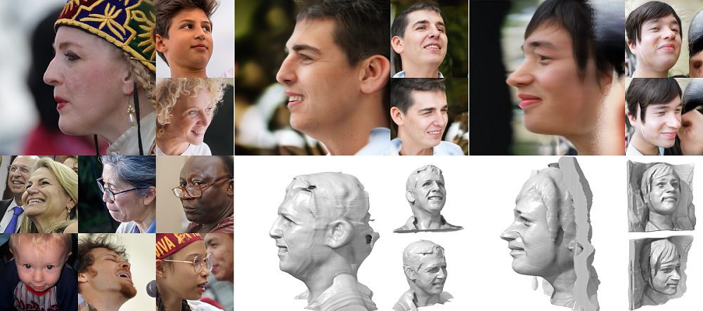

# LPFF-dataset
**LPFF is a large-pose Flickr face dataset comprised of 19,590 high-quality real large-pose portrait images.**




> **[ICCV 2023] [LPFF: A Portrait Dataset for Face Generators Across Large Poses]()**
>
> [Yiqian Wu](https://onethousandwu.com/), Jing Zhang, [Hongbo Fu](http://sweb.cityu.edu.hk/hongbofu/publications.html), [Xiaogang Jin*](http://www.cad.zju.edu.cn/home/jin)

[Paper](https://arxiv.org/abs/2303.14407)              [Video](coming soon)               [Suppl](https://drive.google.com/file/d/1Xktg7oqMMNN9hqGYva3BBTJoux17y2SR/view?usp=sharing)               [Project Page](coming soon)


The creation of 2D realistic facial images and 3D face shapes using generative networks has been a hot topic in recent years. Existing face generators exhibit exceptional performance on faces in small to medium poses (with respect to frontal faces), but struggle to produce realistic results for large poses. The distorted rendering results on large poses in 3D-aware generators further show that the generated 3D face shapes are far from the distribution of 3D faces in reality. We find that the above issues are caused by the training dataset's posture imbalance. 

In this paper, we present **LPFF**, a large-pose Flickr face dataset comprised of 19,590 high-quality real large-pose portrait images. We utilize our dataset to train a 2D face generator that can process large-pose face images, as well as a 3D-aware generator that can generate realistic human face geometry. To better validate our pose-conditional 3D-aware generators, we develop a new FID measure to evaluate the 3D-level performance. Through this novel FID measure and other experiments, we show that LPFF can help 2D face generators extend their latent space and better manipulate the large-pose data, and help 3D-aware face generators achieve better view consistency and more realistic 3D reconstruction results.


<center>Faces generated by EG3D models trained with FFHQ (Left) and Faces generated by EG3D models trained with our new dataset LPFF and FFHQ (Right).</center>

### News  ✨ ✨ 

- [2023-07-14] Our paper is **accepted by ICCV 2023**!
- [2023-07-14] Our dataset, data processing code and training code are available now.

- [2023-03-28] The paper pdf is available: [[2303.14407\] LPFF: A Portrait Dataset for Face Generators Across Large Poses (arxiv.org)](https://arxiv.org/abs/2303.14407)
- [2023-03-28] The supplementary pdf is available: [Google Drive](https://drive.google.com/file/d/1Xktg7oqMMNN9hqGYva3BBTJoux17y2SR/view?usp=sharing)


### Usage

**Our [dataset](https://github.com/oneThousand1000/LPFF-dataset/tree/main/dataset_download), [code](https://github.com/oneThousand1000/LPFF-dataset/tree/main/data_processing), and [pretrained models](https://github.com/oneThousand1000/LPFF-dataset/tree/main/networks) are available now!** ✨ ✨ 

**For those who want to use our dataset, please first [download](https://github.com/oneThousand1000/LPFF-dataset/tree/main/dataset_download) the cropped images and predicted parameters, then [add them to the FFHQ dataset](https://github.com/oneThousand1000/LPFF-dataset-debug-version/tree/main/data_processing#step2-eg3d-and-stylegan-datasets), and finally [perform dataset rebalance](https://github.com/oneThousand1000/LPFF-dataset/tree/main/data_processing#step-3-data-distribution-analysis-and-dataset-rebalance).**


### Available sources

|                                                              | Description                                                  |
| ------------------------------------------------------------ | ------------------------------------------------------------ |
| [dataset](https://github.com/oneThousand1000/LPFF-dataset/tree/main/dataset_download) | Dataset download.                                            |
| [data_processing](https://github.com/oneThousand1000/LPFF-dataset/tree/main/data_processing) | Data processing codes and data download links. Including image alignment, camera parameters extraction, and dataset rebalance. |
| [training](https://github.com/oneThousand1000/LPFF-dataset/tree/main/training) | Model training and FID computation guidance.                 |
| [networks](https://github.com/oneThousand1000/LPFF-dataset/tree/main/networks) | Pretrained StyleGAN2-ada and EG3D models trained on the LPFF+FFHQ  dataset. |


 

### Citation

If you find this project helpful to your research, please consider citing:

```
@misc{wu2023lpff,
      title={LPFF: A Portrait Dataset for Face Generators Across Large Poses}, 
      author={Yiqian Wu and Jing Zhang and Hongbo Fu and Xiaogang Jin},
      year={2023},
      eprint={2303.14407},
      archivePrefix={arXiv},
      primaryClass={cs.CV}
}
```

