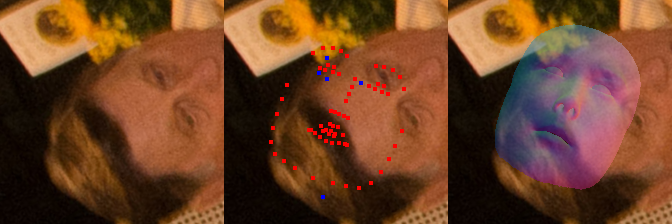
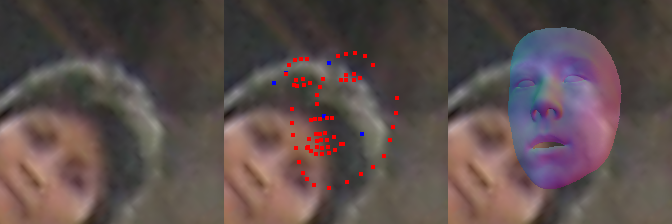
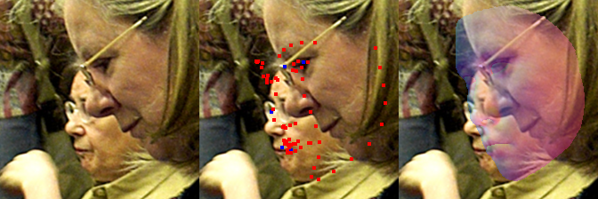
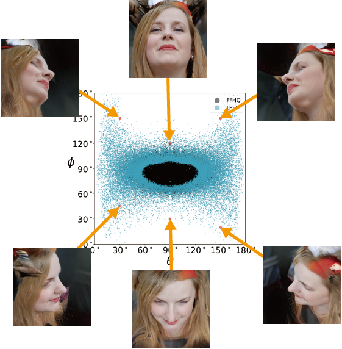

# Data Processing


## Usage

First, follow `step 0` for installation.

:grey_exclamation::grey_exclamation::grey_exclamation:

**If you want to use our LPFF dataset**, you can download our [cropped images and predicted parameters](https://github.com/oneThousand1000/LPFF-dataset/tree/main/dataset_download), and go to `step 2`  and `step 3` for dataset processing.

For those who **want to process custom raw images using our data processing pipeline**, please go to `step 1` for image processing, then go to `step 2`  and `step 3` for dataset processing.


## step 0: installation

```
cd data_processing
conda create -n LPFF python=3.6
source activate LPFF
pip install -r requirements.txt
```


## step1: image alignment (for custom dataset)

```
cd 0_image_processing
```

**Installation**

1. Install  torch and torchvision.

   ```
   pip install torch==1.7.1+cu110 torchvision==0.8.2+cu110 -f https://download.pytorch.org/whl/torch_stable.html
   ```

2. Install other packages.

   ```
   pip install -r requirements.txt
   ```

3. Install Nvdiffrast library.

   ```
   git clone https://github.com/NVlabs/nvdiffrast
   cd nvdiffrast    # ./Deep3DFaceRecon_pytorch/nvdiffrast
   pip install .
   ```

**Data download**

Please download [shape_predictor_68_face_landmarks.dat.bz2](http://dlib.net/files/shape_predictor_68_face_landmarks.dat.bz2), then extract it to `0_image_processing/checkpoints/shape_predictor_68_face_landmarks.dat`.

Following [Deep3DFaceRecon_pytorch model preparation guidance](https://github.com/sicxu/Deep3DFaceRecon_pytorch#inference-with-a-pre-trained-model) to organize all needed files into the following structure:

```
0_image_processing
│
└─── BFM
│   │
│   └─── 01_MorphableModel.mat
│   │
│   └─── Exp_Pca.bin
│   |
│   └─── ...
│
└─── checkpoints
│   │
│   └─── pretrained
│    	│
│    	└─── epoch_20.pth
└─── shape_predictor_68_face_landmarks.dat
```

**Image processing**

Put raw images into `DATADIR/raw`

```
python run_extract_camera_parameter.py --data_dir=DATADIR
```

In this step, we extract the landmarks of all raw images (predicted by face_alignment and dlib), then use the landmarks to realign the raw images to 2400x2400, after that, [Deep3DFaceRecon_pytorch](https://github.com/sicxu/Deep3DFaceRecon_pytorch) is applied to extract camera parameters and compute the density value in FFHQ distribution, only images with the camera `density<0.4` will be reserved. 

We also save the landmarks predicted by Deep3DFaceRecon_pytorch to `DATADIR/realign/lm_5p_pred`. In the following steps, the landmarks predicted by face_alignment and dlib will be discarded, instead, we will use the landmarks predicted by Deep3DFaceRecon_pytorch to crop images.


<u>Then, you **should check results in `DATADIR/realign/debug`, and manually remove all rendering results that significantly misalign with the input image**.</u> 

For example:








Then run:

```
python run_image_crop.py --data_dir=DATADIR
```

In this step, the 2400x2400 realigned images will be cropped according to [EG3D](https://github.com/NVlabs/eg3d#preparing-datasets) and [StyleGAN](https://github.com/NVlabs/ffhq-dataset) alignment functions.

Final camera parameters will be saved to `./data/realign/camera_parameters/*.npy` (npy files) and `./data/realign/camera_parameters/camera_parameters.json `(json file).


<u>You should **check again the cropped results in `DATADIR/realign/crop`, and manually remove all results that are blurry  or have other artifacts.**</u>


## step2: eg3d and stylegan datasets

In this step, we will add our *LPFF* dataset to *FFHQ* dataset.

**If you have already download our cropped images and predicted parameters**, please unzip `eg3d.rar` to `PATH_LPFF_EG3D`, unzip `stylegan.rar`  to `PATH_LPFF_STYLEGAN`, then put `camera_parameters.json` to `PATH_C`.  

**If you have processed your own data using [step1](https://github.com/oneThousand1000/LPFF-dataset/tree/main/data_processing#step-1-image-alignment),** please just set `PATH_LPFF_EG3D=DATADIR/realign/crop/eg3d` and  `PATH_LPFF_STYLEGAN=DATADIR/realign/crop/stylegan`.

```
cd 1_dataset_processing
```

### eg3d

For the FFHQ dataset aligned according to the EG3D alignment function (we name it as *FFHQ-EG3D*), please first get the *FFHQ-EG3D* dataset according to [EG3D](https://github.com/NVlabs/eg3d), and unzip it to `PATH_FFHQ_EG3D`. 

In [EG3D](https://github.com/NVlabs/eg3d/blob/main/dataset_preprocessing/mirror_dataset.py),  the original image `{ID:05d}.png` will be horizontally flipped as `{ID:05d}_mirror.png`.  Since EG3D pruned a small number of images that resisted face detection, *FFHQ-EG3D* only contains 69,957 images (139,914 after the horizontal flip).

:grey_exclamation::grey_exclamation: In this repo, please **rename the 139,914 images in the *FFHQ-EG3D* `{00000.png,00000_mirror.png,...,69999.png,69999_mirror.png}` as `{img00000000.png,img00000001.png,...,img000139912.png,img000139913.png}`**, and put each `img{ID:08d}.png` into the folder  `PATH_FFHQ_EG3D/{int(ID//1000):05d}`

Then download the [dataset-ffhq.json](https://zjueducn-my.sharepoint.com/:u:/g/personal/onethousand_zju_edu_cn/EVwJ5qkVmcJKgIQMz9soMv4BGKV1qdO9Y2mwro5V6ELNDQ?e=9FspJO), and put it to `PATH_FFHQ_EG3D`. 


After that, the *FFHQ-EG3D* dataset should be re-organized into the following structure:: 

| Path                | Files | Description                                |
| ------------------- | ----- | ------------------------------------------ |
| PATH_FFHQ_EG3D      |       | Main folder                                |
| ├ 00000             | 1000  | {img00000000.png , ..., img00000999.png}   |
| ├ 00001             | 1000  | {img00001000.png , ..., img00001999.png}   |
| ├ ...               | ...   | ...                                        |
| ├ 00138             | 1000  | {img00138000.png , ..., img00138999.png}   |
| ├ 00139             | 914   | {img00139000.png , ..., img00139913.png}   |
| └ dataset-ffhq.json | 1     | Camera parameters of *FFHQ-EG3D* dataset . |

Then run:

```
python eg3d_dataset.py --final_crop_dir=PATH_LPFF_EG3D --camera_parameter_path=PATH_C --output_dir=PATH_FFHQ_EG3D
```

Our *LPFF-EG3D* dataset **starts at the index of 139,914**. 

**The final *FFHQ+LPFF-EG3D* dataset contains 179,094 images.**


### stylegan

For the FFHQ dataset aligned to the StyleGAN alignment function (we name it as *FFHQ-StyleGAN*), please first get *FFHQ-StyleGAN* according to [ffhq-dataset](https://github.com/NVlabs/ffhq-dataset), and unzip it to `PATH_FFHQ_STYLEGAN`.

After that, the *FFHQ-StyleGAN* dataset should be organized into the following structure:: 

| Path               | Files | Description                  |
| ------------------ | ----- | ---------------------------- |
| PATH_FFHQ_STYLEGAN |       | Main folder                  |
| ├ 00000            | 1000  | {00000.png , ..., 00999.png} |
| ├ 01000            | 1000  | {01000.png , ..., 01999.png} |
| ├ ...              | ...   | ...                          |
| ├ 68000            | 1000  | {68000.png , ..., 68999.png} |
| └ 69000            | 1000  | {69000.png , ..., 69999.png} |

Then run:

```
python stylegan_dataset.py --final_crop_dir=PATH_LPFF_STYLEGAN --output_dir=PATH_FFHQ_STYLEGAN
```

The *FFHQ-StyleGAN* dataset applies horizontal flip in training. Thus the *FFHQ-StyleGAN* contains 70,000 images, and our *LPFF-StyleGAN* **starts at the index of 70,000**.

**The final *FFHQ+LPFF-StyleGAN* dataset contains 89,590 images.**


## step 3: data distribution analysis and dataset rebalance

```
cd ../
cd 2_dataset_rebalance
```


### Convert camera positions into theta and phi angles.

```
python 0_compute_theta_phi.py --eg3d_dataset_dir=PATH_FFHQ_EG3D
```


You can use 

```
from camera_utils import LookAtPoseSampler
cam = LookAtPoseSampler.sample(theta, phi, cam_pivot, radius=cam_radius, device=device)
```

 to sample the camera pose using theta and phi angles.

The visualization of theta and phi:



### Compute the density function of the *FFHQ+LPFF-EG3D* dataset.

```
python 1_compute_density.py
```

### Generate EG3D file name lists that are used to load data in training.

```
python 2_eg3d_FFHQ.py --eg3d_dataset_dir=PATH_FFHQ_EG3D
```

```
python 2_eg3d_LPFF.py --eg3d_dataset_dir=PATH_FFHQ_EG3D
```

```
python 2_eg3d_FFHQ_rebalanced.py --eg3d_dataset_dir=PATH_FFHQ_EG3D
```

```
python 2_eg3d_FFHQ_LPFF.py --eg3d_dataset_dir=PATH_FFHQ_EG3D
```

```
python 2_eg3d_FFHQ_LPFF_rebalanced.py --eg3d_dataset_dir=PATH_FFHQ_EG3D
```

### Generate StyleGAN  file name lists that are used to load data in training. 

```
python 3_stylegan_FFHQ.py --stylegan_dataset_dir=PATH_FFHQ_STYLEGAN
```

```
python 3_stylegan_FFHQ_LPFF.py --stylegan_dataset_dir=PATH_FFHQ_STYLEGAN
```

```
python 3_stylegan_FFHQ_LPFF_rebalanced.py --stylegan_dataset_dir=PATH_FFHQ_STYLEGAN
```

### Finally, zip the dataset.

```
python eg3d_dataset_tool.py --source=PATH_FFHQ_EG3D --dest=PATH_FFHQ_LPFF_EG3D_ZIP --width 512 --height 512
```

```
python stylegan_dataset_tool.py --source=PATH_FFHQ_STYLEGAN --dest=PATH_FFHQ_LPFF_STYLEGAN_ZIP
```
