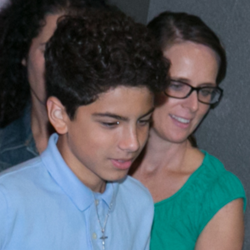
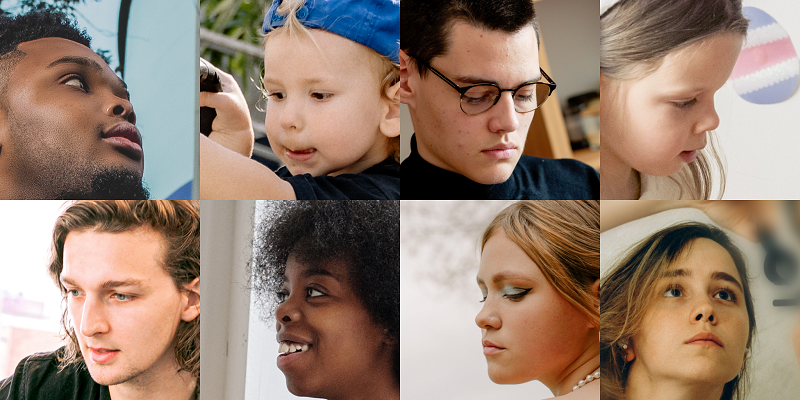

# Data download

## License

:grey_exclamation::grey_exclamation::grey_exclamation: The ***LPFF*** dataset and ***Unsplash-Pexels*** dataset are available for **non-commercial research purposes** only.

## Introduction

Notice that we propose the ***LPFF*** dataset as a **supplement** to the ***[FFHQ](https://github.com/NVlabs/ffhq-dataset)*** dataset, in order to train 2D and 3D-aware face generators. 

So if you need a full dataset, please [**ADD** our dataset to ***FFHQ*** dataset](https://github.com/oneThousand1000/LPFF-dataset/tree/main/data_processing#step-2-eg3d-and-stylegan-datasets).

Besides simply combining ***LPFF*** and ***FFHQ***, please further rebalance the dataset using our [rebalance strategy](https://github.com/oneThousand1000/LPFF-dataset/tree/main/data_processing#step-3-data-distribution-analysis-and-dataset-rebalance).

For detailed information and analysis, please refer to our [main paper](). 

## LPFF dataset

**License:** 

> We collected images from the [Flickr ](https://www.flickr.com)website, under [CC-BY-2.0](https://creativecommons.org/licenses/by/2.0/), [Public-Domain-Mark-1.0](https://creativecommons.org/publicdomain/mark/1.0/), [CC-BY-SA-2.0](https://creativecommons.org/licenses/by-sa/2.0/), or [CC0-1.0](https://creativecommons.org/publicdomain/zero/1.0/) licenses.  The license and original author of each image are indicated in the metadata.

For detailed information and analysis, please refer to our [supplement file](). 

**download:**    [LPFF-dataset](https://zjueducn-my.sharepoint.com/:f:/g/personal/onethousand_zju_edu_cn/EipRJ01HXsdAihMjwXSqHS0BpGlyqrrWLapNIWGmE9x-ig?e=HfI1Li)

| Dir/file                                                     | Description                                                  | Files  | Example (e.g., image id = `100004356@N06_21795165006_01`)    |
| ------------------------------------------------------------ | ------------------------------------------------------------ | ------ | ------------------------------------------------------------ |
| ├ [camera_parameters.json](https://zjueducn-my.sharepoint.com/:u:/g/personal/onethousand_zju_edu_cn/Ebxz-uVr55dNmhTC7r9G7ioBZmYe67DZH2xvarooDXMsVQ?e=ccrYU2) | The extracted camera parameters of images in the *LPFF* dataset. | 1      | {    "100004356@N06_21795165006_01":  [  0.8436030745506287,  -0.05643552541732788,  0.5339932441711426,  -1.3756788969039917,  0.1792474240064621,  -0.907820999622345,  -0.3791190981864929,  0.9812977910041809,  0.5061661005020142,  0.41554296016693115,  -0.7557247281074524,  2.105839967727661,  0.0,  0.0,  0.0,  1.0,  4.2647,  0.0,  0.5,  0.0,  4.2647,  0.5,  0.0,  0.0,  1.0 ],      ....... } |
| ├ [info.json](https://zjueducn-my.sharepoint.com/:u:/g/personal/onethousand_zju_edu_cn/EfZJFXVHRsxKtZQNN1yOXawBPouiOaTuHq3y9swtIxIFyg?e=RX7JZL) | The images' metadata (obtained by using Flickr's official API). | 1      | { "100004356@N06_21795165006_01": {   "raw_image_name": "100004356@N06_21795165006",   "image_info": {    "photo_id": "21795165006",    "user_id": "100004356@N06",    "photo_url": "https://www.flickr.com/photos/100004356@N06/21795165006/",    "server": "5727",    "secret": "809c964c3a",    "originalsecret": "4840597377",    "originalformat": "jpg",    "low_resolution_download_url": "https://live.staticflickr.com/5727/21795165006_809c964c3a_z_d.jpg",    "high_resolution_download_url": "https://live.staticflickr.com/5727/21795165006_4840597377_o_d.jpg",    "license": {     "name": "Attribution License",     "url": "https://creativecommons.org/licenses/by/2.0/"    },    "username": "cbcmemberphotos2477"   }  },     .... } |
| ├ [crop](https://zjueducn-my.sharepoint.com/:f:/g/personal/onethousand_zju_edu_cn/EpFHGuC7b1NAgVYL5ezJ_BIBD4NlPJD_4yqFdoyTm4cVVw?e=xzlrxt) | The cropped images.                                          | 39,180 |                                                              |
| │ ├ [eg3d.rar](https://zjueducn-my.sharepoint.com/:u:/g/personal/onethousand_zju_edu_cn/EdGQtInWXsNPil28Uyi7JqgBpNZKjUMY49FVqjGWvs0SUw?e=GvDDFq) | The cropped images. Processed according to the eg3d alignment function. **(Should be combined with the [FFHQ dataset that is aligned to eg3d](https://github.com/NVlabs/eg3d#preparing-datasets))** | 19,590 |  |
| │ ├ [stylegan.rar](https://zjueducn-my.sharepoint.com/:u:/g/personal/onethousand_zju_edu_cn/EQFwBvuLfklJkKf-v0ogo1ABMkIZNh4LZbaH43V12Vl4BA?e=hivwbq) | The cropped images. Processed according to the stylegan alignment function. **(Should be combined with the [FFHQ that are aligned to stylegan](https://github.com/NVlabs/ffhq-dataset))** | 19,590 |  |
| ├ [raw.rar](https://zjueducn-my.sharepoint.com/:u:/g/personal/onethousand_zju_edu_cn/EbC4y2eGNgRIgzmUucDvHRkB3W9rYqK8WdK97fty9l425A?e=Z4K3ia) | The raw images.                                              | 17,455 |  |
| ├ [raw_lm.json](https://zjueducn-my.sharepoint.com/:u:/g/personal/onethousand_zju_edu_cn/ERdpdiRaaNpNldwW5RclbeoBH5ShrtQH64JEayEdbxvgMw?e=MKxOcm) | The landmarks in **raw** images (predicted by [face-alignment](https://github.com/1adrianb/face-alignment) and dlib). | 1      | { "100004356@N06_21795165006_01": [[940, 311], ....., [1026, 374]],   .... } |
| ├ [realign2400.rar](https://zjueducn-my.sharepoint.com/:u:/g/personal/onethousand_zju_edu_cn/EfU_ucqFG5pFrk9OT4bHqw8Bd9NGmAwlhPnuhvOFwufNAQ?e=rgs2bD) | The realigned images with resolution of 2400x2400.           | 19,590 |  |
| └ [realign2400_lm.json](https://zjueducn-my.sharepoint.com/:u:/g/personal/onethousand_zju_edu_cn/EWdsxjnBw1dKsK1e9yxKp0sBWrbblHn9kCM3jFLoEwka_A?e=jm3prz) | The landmarks in the**realign2400** images (predicted by [Deep3DFaceRecon_pytorch](https://github.com/sicxu/Deep3DFaceRecon_pytorch)). | 1      | { 100004356@N06_21795165006_01": [[649.2045419386684, 1046.78209501742], ... [1168.8776091902992, 1566.5724901184285]],   .... } |

## Unsplash-Pexels dataset

Besides the images from [Flickr](https://www.flickr.com), we additionally collect **19,321** images from [Unsplash](https://unsplash.com) and [Pexels](https://www.pexels.com), and process them using the same image processing method as ***LPFF***. We denote the obtained dataset  as ***Unsplash-Pexels*** dataset.

We **DO NOT** use ***Unsplash-Pexels*** as our training data but propose this dataset to inspire and facilitate more work in the future. 

For detailed information and analysis, please refer to our [supplement file](). 

**License:** 

> The images are collected from Unsplash and Pexels with the permission of noncommercial purposed download. Please refer to [Unsplash license](https://unsplash.com/license) and [Pexels license](https://www.pexels.com/zh-cn/license/) for more information.

**download:**  [Unsplash-Pexels-dataset](https://zjueducn-my.sharepoint.com/:f:/g/personal/onethousand_zju_edu_cn/ErWuktR6pNZIj5R82pH2FpAB5pW06HtTGrCfXCi-2sY1WA?e=bFKEcd)

| Dir/file                                                     | Description                                                  | Files  | Example  (e.g., image id = `guess-attic-girl-woman-pretty_01`) |
| ------------------------------------------------------------ | ------------------------------------------------------------ | ------ | ------------------------------------------------------------ |
| ├ [camera_parameters.json](https://zjueducn-my.sharepoint.com/:u:/g/personal/onethousand_zju_edu_cn/EbMZznzIfPhEol3WOEaX_HwBwNQ6lg42DsO-1M0AdCfL0w?e=ethpco) | The extracted camera parameters of images in the *Unsplash-Pexels* dataset. | 1      | {    "guess-attic-girl-woman-pretty_01": [   0.7822178602218628,   -0.24413354694843292,   0.5731788873672485,   -1.4835724830627441,   -0.1928202509880066,   -0.9697182774543762,   -0.14988917112350464,   0.3528100848197937,   0.5924149751663208,   0.006725475192070007,   -0.805604875087738,   2.2281243801116943,   0.0,   0.0,   0.0,   1.0,   4.2647,   0.0,   0.5,   0.0,   4.2647,   0.5,   0.0,   0.0,   1.0 ],     ....... } |
| ├ [info.json](https://zjueducn-my.sharepoint.com/:u:/g/personal/onethousand_zju_edu_cn/EWpHruL3imlDl5_4TLX2FPMBLpEx64vYB0hJQ4YxAXA-kg?e=H8ECIc) | The images' URLs.                                            | 1      | { 	"guess-attic-girl-woman-pretty_01": "https://images.pexels.com/photos/34525/guess-attic-girl-woman-pretty.jpg",     .... } |
| ├ [crop]()                                                   | The cropped images.                                          | 38,642 |                                                              |
| │ ├ [eg3d.rar](https://zjueducn-my.sharepoint.com/:u:/g/personal/onethousand_zju_edu_cn/EfrRh4yPv1tLr8hdrK0yykABID8J8XeN7laZFFd4hsxcTQ?e=qLsLv7) | The cropped images. Processed according to the eg3d alignment function. | 19,321 |  |
| │ ├ [stylegan.rar](https://zjueducn-my.sharepoint.com/:u:/g/personal/onethousand_zju_edu_cn/EefZJUZ3_fhEvyKiitonuWkBYbVEID4Zu0UIbgx_ylsFwA?e=D4TFfP) | The cropped images. Processed according to the stylegan alignment function. | 19,321 |  |
| ├ [raw.rar](https://zjueducn-my.sharepoint.com/:u:/g/personal/onethousand_zju_edu_cn/ERunIfbqJAFHrR8x7SHaJoIBhSSv2xKrfy5nynj8uvrhxw?e=06YVgq) | The raw images.                                              | 17,948 |  |
| ├ [raw_lm.json](https://zjueducn-my.sharepoint.com/:u:/g/personal/onethousand_zju_edu_cn/EWa1ComuyqxHiBafZRFHU9QBzUKS2mzQZEnR40jjHzyzmQ?e=Z0ztAx) | The landmarks in **raw** images (predicted by [face-alignment](https://github.com/1adrianb/face-alignment) and dlib). | 1      | { "guess-attic-girl-woman-pretty_01": [[1050, 1247], ....., [1706, 1297]],   .... } |
| ├ [realign2400.rar](https://zjueducn-my.sharepoint.com/:u:/g/personal/onethousand_zju_edu_cn/ESwAXG2pS6BJqUUo2ItuyP0Bg00iXJj1IrmGUndLhzOnFA?e=Q0k56X) | The realigned images with resolution of 2400x2400.           | 19,321 |  |
| └ [realign2400_lm.json](https://zjueducn-my.sharepoint.com/:u:/g/personal/onethousand_zju_edu_cn/ESSjcBqbWtBEq0jjjRrMT1ABdpU6cicWE_mW87Gkj4Q99g?e=ZOQgjL) | The landmarks in the **realign2400** images (predicted by [Deep3DFaceRecon_pytorch](https://github.com/sicxu/Deep3DFaceRecon_pytorch)). | 1      | { "guess-attic-girl-woman-pretty_01": [[614.9565077737698, 1253.4279491778047], ... [1281.4964235236844, 1485.315768539409]],   .... } |

